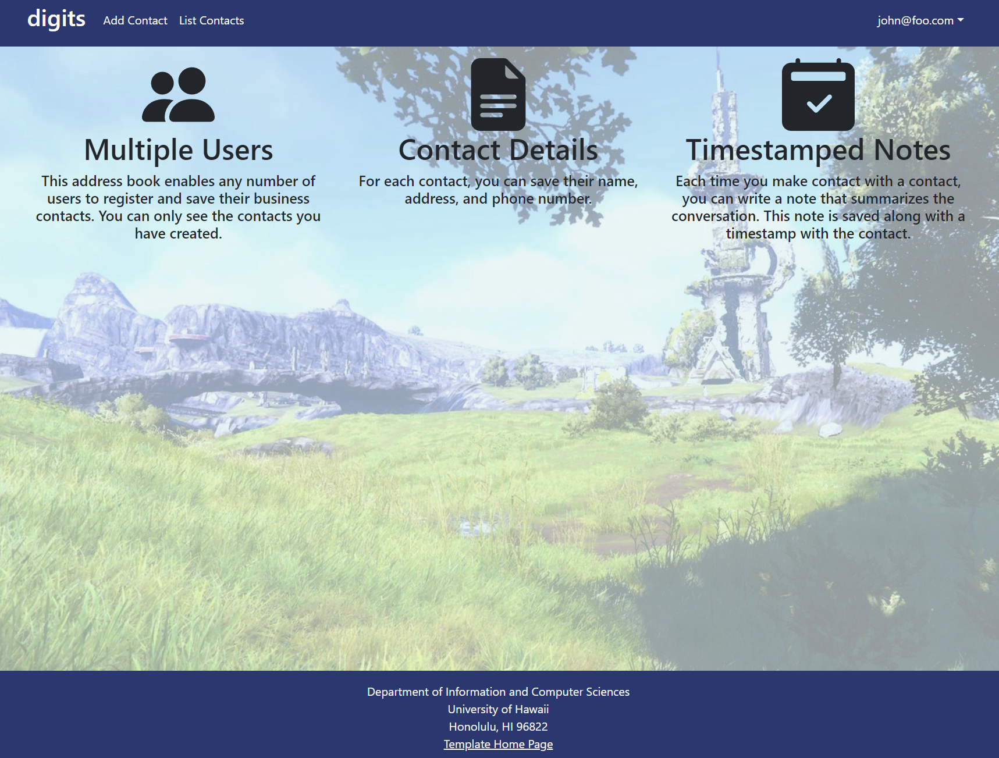
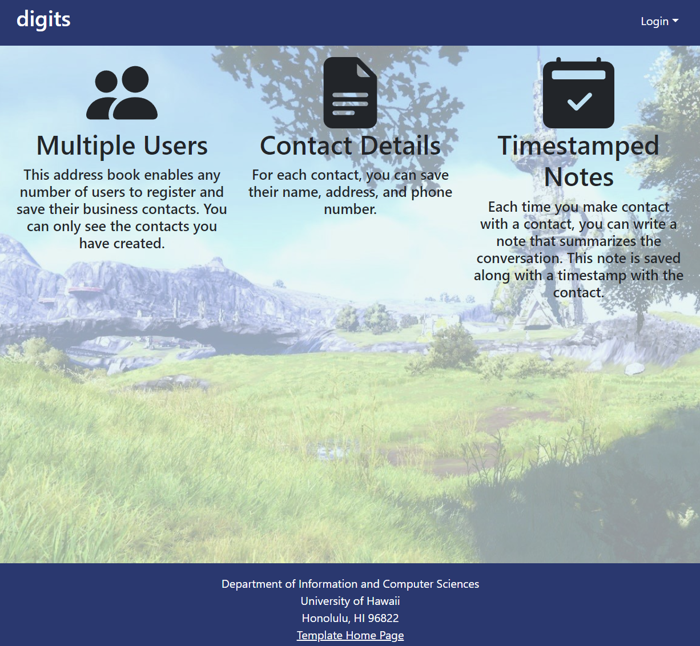
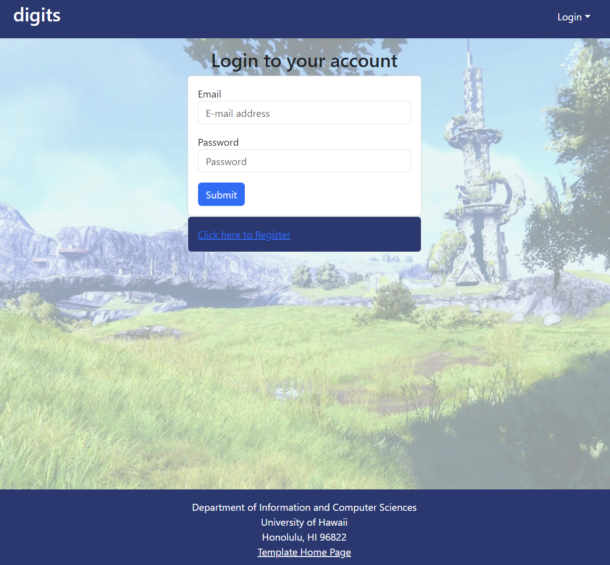
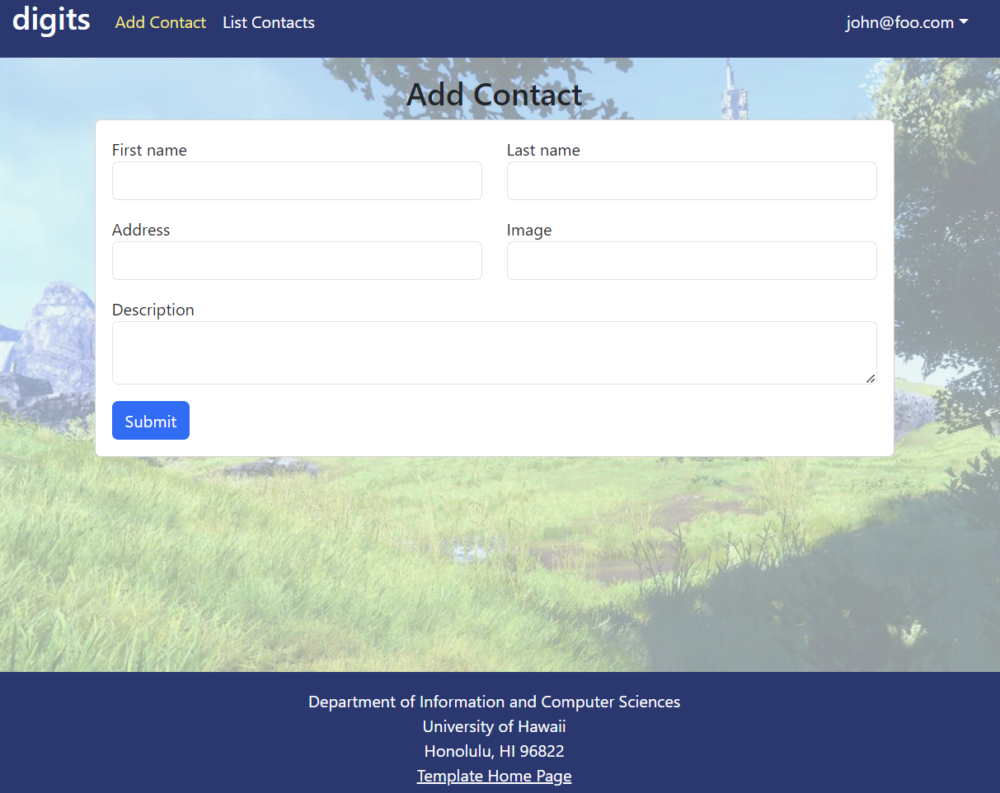
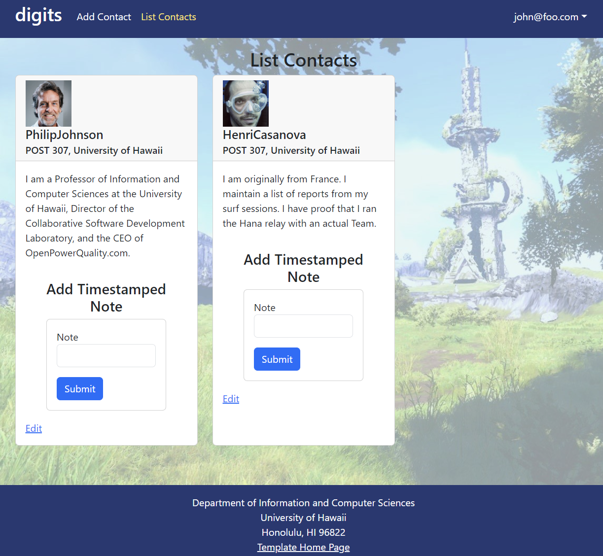
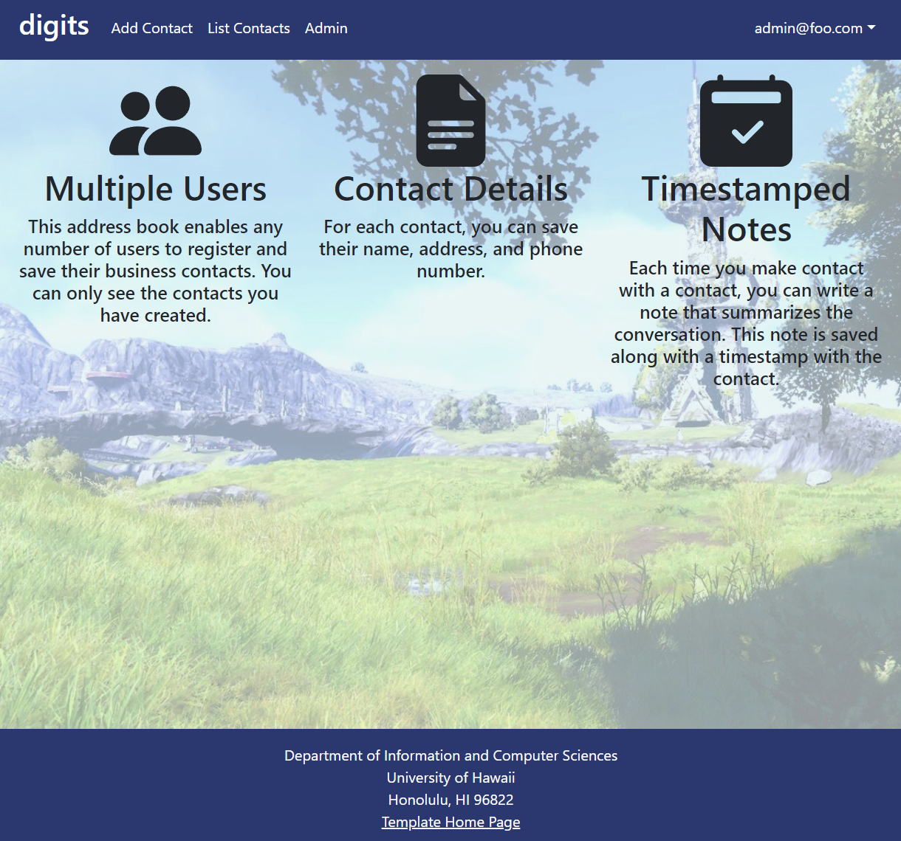
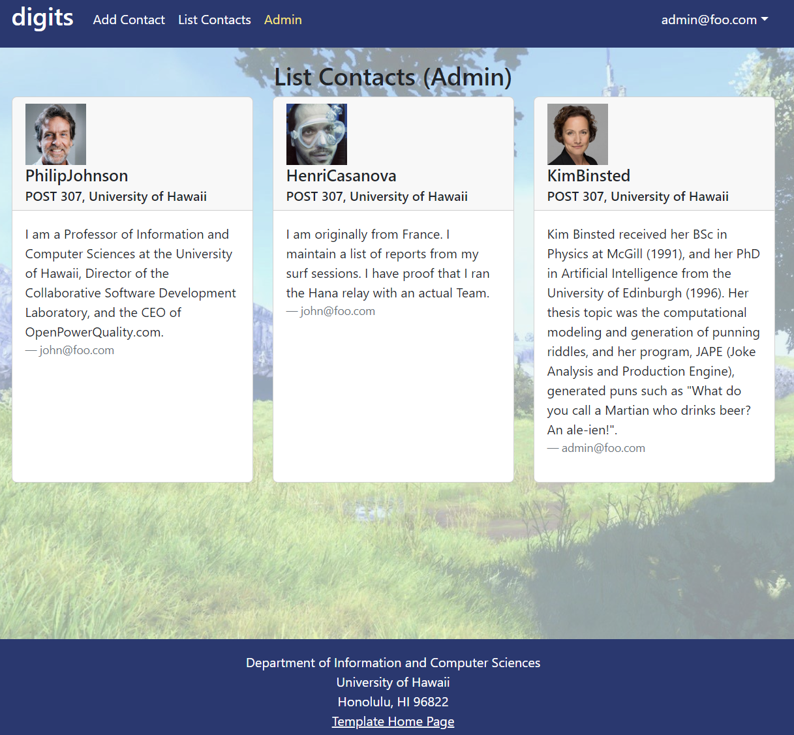

digits is a Meteor application that allows registered users to create their own address book of business contacts.

## Installation

First, [install Meteor](https://www.meteor.com/install), and [GitHub Desktop](https://desktop.github.com/).

Second, go to [https://github.com/johnserraon/digits](https://github.com/johnserraon/digits), click the "Code" dropdown and clone the digits repo (i.e. using the "Open with GitHub Desktop" option). Complete the dialog box to create a new repository 
that 
you 
own 
that is 
initialized 
with 
this 
application's files.

Third, cd into the app/ directory of your local copy of the repo, and install third party libraries with:

```
$ meteor npm install
```

## Running the system

Once the libraries are installed, you can run the application by invoking the "start" script in the [package.json file](https://github.com/johnserraon/digits/blob/cleanup/app/package.json):

```
$ meteor npm run start
```

The first time you run the app, it will create some default users and data. Here is the output:

```
 meteor npm run start 

>> meteor-application-template-react@ start C:\Users\YOUR_USERNAME\Documents\GitHub\digits\app
> meteor --no-release-check --exclude-archs web.browser.legacy,web.cordova --settings ../config/settings.development.json

[[[[[ C:\Users\YOUR_USERNAME\Documents\GitHub\digits\app ]]]]]

=> Started proxy.
=> Started HMR server.
=> Started MongoDB.
I20240402-19:55:54.185(-10)? Creating the default user(s)
I20240402-19:55:54.201(-10)?   Creating user admin@foo.com.
I20240402-19:55:54.405(-10)?   Creating user john@foo.com.
I20240402-19:55:54.490(-10)? Creating default contacts.
I20240402-19:55:54.491(-10)?   Adding: Johnson (john@foo.com)
I20240402-19:55:54.507(-10)?   Adding: Casanova (john@foo.com)
I20240402-19:55:54.510(-10)?   Adding: Binsted (admin@foo.com)
=> Started your app.

=> App running at: http://localhost:3000/

```

Periodically, you might see `Error starting Mongo (2 tries left): Cannot run replSetReconfig because the node is currently updating its configuration` after the `=> Started HMR server.`. It doesn't seem to be a problem since the MongoDB does start.

### Viewing the running app

If all goes well, the template application will appear at [http://localhost:3000](http://localhost:3000).  You can login using the credentials in [settings.development.json](https://github.com/johnserraon/digits/blob/cleanup/config/settings.development.json), or else register a new account.

### ESLint

You can verify that the code obeys our coding standards by running ESLint over the code in the imports/ directory with:

```
meteor npm run lint
```

## Application Walkthrough

The following sections describe the major features of digits.

#### Landing page

When you retrieve the app at http://localhost:3000, this is what should be displayed:



The next step is to use the Login menu to either Login to an existing account or register a new account.

#### Login page

Clicking on the Login link, then on the Sign In menu item displays this page:



#### Register page

Alternatively, clicking on the Login link, then on the Sign Up menu item displays this page:


#### Landing (after Login) page, non-Admin user

Once you log in (either to an existing account or by creating a new one), the navbar changes as follows:


You can now add new contact cards, and list the contacts you have created. Note you cannot see any contacts created by other users.

#### Add Contact page

The Add Contact page allows a user to add a new contact card containing a first name, last name, business address, image URL, and description of their contact.



#### List Contacts page

The List Contacts page shows all contact cards that the user has created or has associated with their account.



* Each contact card is equipped with a section to write timestamped notes, helping users keep track of business plans and other miscellaneous contact information.


* You can also click the "Edit" link to go to the Edit Contact page, described next.

#### Edit Contact page

After clicking on the "Edit" link associated with a contact, the details of the card can be edited.


#### Landing (after Login), Admin user

You can define an "admin" user in the settings.json file. This user, after logging in, gets a special entry in the navbar:



#### Admin page (list all users stuff)

To provide a simple example of a "super power" for Admin users, the Admin page lists all of the contacts by all of the users:



Note that non-admin users cannot get to this page, even if they type in the URL by hand.

### Collections

The application implements a single Collection called "Contacts". Each Contacts document has the following fields: firstName, lastName, address, image, description, and owner.

The Contacts collection is defined in [imports/api/contact/Contacts.js](https://github.com/johnserraon/digits/blob/cleanup/app/imports/api/contact/Contacts.js).

The Contacts collection is initialized in [imports/startup/server/Mongo.js](https://github.com/ics-software-engineering/meteor-application-template-react/blob/main/app/imports/startup/server/Mongo.js).

### CSS

The application uses the [React implementation of Bootstrap 5](https://react-bootstrap.github.io/). You can adjust the theme by editing the `app/client/style.css` file. To change the theme override the Bootstrap 5 CSS variables.

```css
/* Change bootstrap variable values.
 See https://getbootstrap.com/docs/5.2/customize/css-variables/
 */
body {
  --bs-light-rgb: 236, 236, 236;
}

/* Define custom styles */
.gray-background {
  background-color: var(--bs-gray-200);
  color: var(--bs-dark);
  padding-top: 10px;
  padding-bottom: 20px;
}
```

### Routing

For display and navigation among its four pages, the application uses [React Router](https://reacttraining.com/react-router/).

Routing is defined in [imports/ui/layouts/App.jsx](https://github.com/johnserraon/digits/blob/cleanup/app/imports/ui/layouts/App.jsx).


### Authentication

For authentication, the application uses the Meteor accounts package.

When the application is run for the first time, a settings file (such as [config/settings.development.json](https://github.com/johnserraon/digits/blob/cleanup/config/settings.development.json)) should be 
passed to Meteor. That will lead to a default account being created through the code in [imports/startup/server/Accounts.js](https://github.com/johnserraon/digits/blob/cleanup/app/imports/startup/server/Accounts.js).

The application allows users to register and create new accounts at any time.

### Authorization

Only logged in users can manipulate Contact cards (but any registered user can manipulate any Contact card, even if they weren't the user that created it.)

### Configuration

The [config](https://github.com/johnserraon/digits/tree/cleanup/config) directory is intended to hold settings files.  The repository contains one file: [config/settings.development.json](https://github.com/johnserraon/digits/blob/cleanup/config/settings.development.json).

The [.gitignore](https://github.com/johnserraon/digits/blob/cleanup/.gitignore) file prevents a file named settings.production.json from being committed to the repository. So, if you are deploying the application, you can put settings in a file named settings.production.json and it will not be committed.

### Quality Assurance

#### ESLint

The application includes a [.eslintrc](https://github.com/johnserraon/digits/blob/cleanup/app/.eslintrc.js) file to define the coding style adhered to in this application. You can invoke ESLint from the command line as follows:

```
[~/digits/app]-> meteor npm run lint

> digits@ lint /Users/YOUR_USERNAME/digits/app
> eslint --quiet ./imports
```

ESLint should run without generating any errors.

It's significantly easier to do development with ESLint integrated directly into your IDE (such as IntelliJ).

## Screencasts

For more information about this system, please watch one or more of the following screencasts. Note that the current source code might differ slightly from the code in these screencasts, but the changes should be very minor.

  * [Walkthrough of system user interface (6 min)](https://youtu.be/48xu1hrqUi8)
  * [Data and accounts structure and initialization (18 min)](https://youtu.be/HZRjwrVBWp4)
  * [Navigation, routing, pages, components (34 min)](https://youtu.be/XztTdHpv6Jw)
  * [Forms (32 min)](https://youtu.be/8FyWR3gUGCM)
  * [Authorization, authentication, and roles (12 min)](https://youtu.be/9HX5vuXTlvA)
